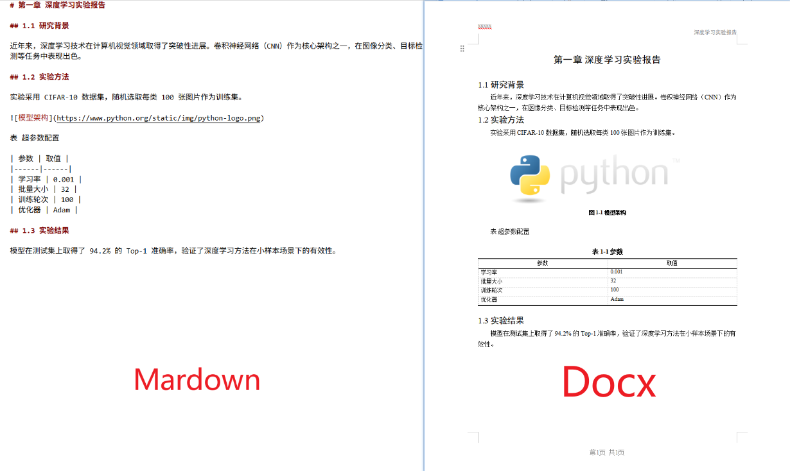

# mddocx — Markdown 转学术格式 DOCX

[](https://www.claudepluginhub.com/plugins/trisia-mddocx)
[](https://github.com/openai/codex)
[](https://cursor.com)
[](https://opencode.ai)
[](https://www.npmjs.com/package/@cliven/mddocx)
[](https://github.com/Trisia/mddocx/releases)
[](LICENSE)
[](https://python.org)
[](https://github.com/Trisia/mddocx/actions/workflows/release.yml)
[](https://clawhub.ai/Trisia/mddoc)

将 Markdown 转换为符合学术规范的 Word 文档的Agent Skill，支持 LaTeX 公式（OMML，含矩阵/分段函数等环境）、三线表、图题/表题自动编号、页码、页眉等学术论文排版规范。



## 安装

### 🤖 一键安装

将以下内容复制粘贴给任意智能体（Claude Code / Codex / OpenCode / Cursor）即可安装。

> 各平台专属安装说明详见 **[INSTALL.md](INSTALL.md)**。

```copy
请根据 https://github.com/Trisia/mddocx/blob/main/INSTALL.md 中对应平台的说明，帮我安装 mddocx
```

### 依赖

```bash
pip install python-docx Pillow requests mistune
```

## 使用

### npx（无需安装）

```bash
npx @cliven/mddocx paper.md                    # 转换文件
npx @cliven/mddocx paper.md -o output.docx     # 指定输出
npx @cliven/mddocx --text "# 标题" -o out.docx # 转换文本
```

### Claude Code 中

```
/mddoc paper.md                    # 转换 Markdown 文件
/mddoc @paper.md                   # @引用文件
/mddoc 把这段内容转成Word         # 粘贴 Markdown 文本
```

### 命令行直接使用

```bash
# 转换文件（输出到同目录）
python skills/mddoc/scripts/md2docx.py paper.md

# 指定输出路径
python skills/mddoc/scripts/md2docx.py paper.md -o output.docx

# 直接转换文本
python skills/mddoc/scripts/md2docx.py --text "# 标题\n\n正文" -o out.docx
```

## 格式规范

生成的文档自动应用以下学术排版规范：

| 元素 | 格式 |
|------|------|
| 题目 | 三号黑体(16pt)、居中、上下空一行 |
| 一级标题 | 三号黑体、居中、前加分页符、outline_level=1 |
| 二级标题 | 四号黑体(14pt)、顶格、不加粗、outline_level=2 |
| 三级标题 | 小四宋体(12pt)、首行缩进、不加粗、outline_level=3 |
| 正文 | 五号(10.5pt)、首行缩进2字符、1.3倍行距 |
| 表格 | 三线表(顶线粗/表头底线细/底线粗)、表头重复 |
| 图题 | 小五(9pt)宋体加粗居中、"图1-1 xxx"格式 |
| 表题 | 五号(10.5pt)宋体加粗居中、"表1-1 xxx"格式 |
| 页码 | "第×页 共×页"、页脚边距1cm |
| 列表 | 有序列表用（1）（2）（3）序号 |
| 行内公式 | $...$ 转 OMML、嵌于段落 |
| 行间公式 | $$...$$ 转 OMML 居中、编号(章-序号)右对齐 |
| LaTeX 环境 | matrix/bmatrix/pmatrix/vmatrix 矩阵、cases 分段函数 |
| 代码块 | Courier New 等宽、五号、左缩进 |
| 页边距 | 左3cm 右2cm 上2cm 下2cm |

## 升级

### npm

```bash
npm update -g @cliven/mddocx       # 全局安装升级
npx @cliven/mddocx@latest paper.md # npx 始终使用最新版
```

### Claude Code / Codex / Cursor

```bash
# 插件方式安装的，进入插件目录拉取
cd ~/.claude/plugins/mddocx && git pull   # Claude Code
cd ~/.codex/plugins/mddocx && git pull    # Codex
cd ~/.cursor/plugins/mddocx && git pull   # Cursor

# 或重新克隆安装
git clone https://github.com/Trisia/mddocx /tmp/mddocx
cp -rf /tmp/mddocx/skills/mddoc ~/.claude/skills/mddoc
```

### OpenCode

更新 `opencode.json` 中的插件引用，重启即可自动拉取最新版本。

### Python 依赖

```bash
pip install --upgrade python-docx Pillow requests mistune
```

