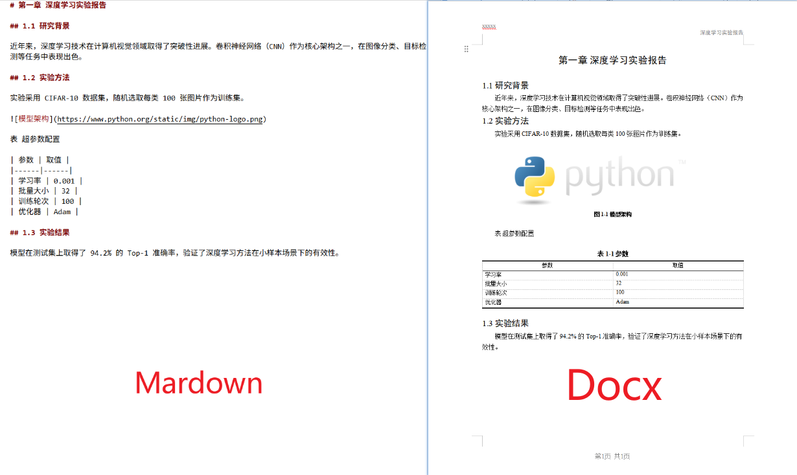

# mddocx — Markdown 转学术格式 DOCX

[](https://www.claudepluginhub.com/plugins/trisia-mddocx)
[](https://github.com/openai/codex)
[](https://cursor.com)
[](https://opencode.ai)
[](./dsh)
[](https://www.npmjs.com/package/@cliven/mddocx)
[](https://github.com/Trisia/mddocx/releases)
[](LICENSE)
[](https://python.org)
[](https://github.com/Trisia/mddocx/actions/workflows/release.yml)
[](https://clawhub.ai/trisia/skills/mddoc)

将 Markdown 转换为符合学术规范的 Word 文档的Agent Skill，支持 LaTeX 公式（OMML，含矩阵/分段函数等环境）、三线表、图题/表题自动编号、页码、页眉等学术论文排版规范。



## 1. 安装

### 1.1 npx skills（推荐，全平台技能安装）

```bash
npx skills add Trisia/mddocx -g -a claude-code codex cursor opencode -y
```

安装/升级/路径详见 **[INSTALL.md](INSTALL.md)**。

### 1.2 npm（全平台通用，安装后可免 `npx` 直接用 `mddocx` 命令）

```bash
npm install -g @cliven/mddocx
```

Python 依赖由 `setup_env.py` 自动安装，详见下方「依赖」。

### 1.3 DeepSeek Harness（DSH 原生插件）

```bash
npm install -g @cliven/mddocx     # ① 安装 npm 包（含转换引擎 + DSH 插件）
```

在你预设的 `agent.cordis.yml` 末尾追加一行（`name` 用插件文件的绝对路径）：

```yaml
- id: mddocx
  name: '<npm root -g 输出>/@cliven/mddocx/dsh/mddocx.mjs'
```

重新开一个使用该预设的会话，模型即可直接调用 `mddocx` 工具（`text` / `path` / `output` 三参数），详见 **[dsh/README.md](dsh/README.md)**。

> 各平台专属安装/升级说明（Claude Code / Codex / OpenCode / Cursor / DeepSeek Harness / Claude PluginHub / ClawHub）详见 **[INSTALL.md](INSTALL.md)**。


## 2. 使用

### 2.1 Agent 中使用（通过 npx skills 选用）

装到哪个 Agent，就在哪个 Agent 内用 `/mddoc` 触发：

```
/mddoc paper.md                    # 转换 Markdown 文件
/mddoc @paper.md                   # @引用文件
/mddoc 把这段内容转成Word         # 粘贴 Markdown 文本
```


### 2.2 npx（通过npm安装选用）

```bash
npx @cliven/mddocx paper.md                    # 转换文件
npx @cliven/mddocx paper.md -o output.docx     # 指定输出
npx @cliven/mddocx --text "# 标题" -o out.docx # 转换文本
```

## 3. 文档格式规范

生成的文档自动应用以下学术排版规范：

| 元素 | 格式 |
|------|------|
| 题目 | 三号黑体(16pt)、居中、上下空一行 |
| 一级标题 | 三号黑体、居中、前加分页符、outline_level=1 |
| 二级标题 | 四号黑体(14pt)、顶格、不加粗、outline_level=2 |
| 三级标题 | 小四宋体(12pt)、首行缩进、不加粗、outline_level=3 |
| 正文 | 五号(10.5pt)、首行缩进2字符、1.3倍行距 |
| 表格 | 三线表(顶线粗/表头底线细/底线粗)、表头重复 |
| 图题 | 小五(9pt)宋体加粗居中、"图1-1 xxx"格式 |
| 表题 | 五号(10.5pt)宋体加粗居中、"表1-1 xxx"格式 |
| 页码 | "第×页 共×页"、页脚边距1cm |
| 页眉 | 黑体9pt、左固定"xxxxx"、右为文档题目（无题目显示"未命名文档"） |
| 页脚 | 居中"第×页 共×页"（宋体10.5pt、PAGE/NUMPAGES域）、距底边1cm |
| 列表 | Word 原生编号/项目符号、首行缩进2字符、多级嵌套(3级) |
| 加粗/斜体 | `**加粗**` bold、`*斜体*` italic、`***加粗斜体***` bold+italic |
| 分隔线 | `---` → 分页符 |
| 行内公式 | $...$ 转 OMML、嵌于段落、与加粗斜体共存 |
| 行间公式 | $$...$$ 转 OMML 居中、编号(章-序号)右对齐 |
| LaTeX 环境 | matrix/bmatrix/pmatrix/vmatrix 矩阵、cases 分段函数、align 多行对齐 |
| 代码块 | 等宽字体、五号、灰色背景 |
| 页边距 | 左3cm 右2cm 上2cm 下2cm |

## 4. 升级

### 4.1 npx skills（npx skills 方式安装的）

```bash
npx skills update   # 更新所有已安装技能到最新版
```

### 4.2 npm

```bash
npm update -g @cliven/mddocx       # 全局安装升级
npx @cliven/mddocx@latest paper.md # npx 始终使用最新版
```

> 其他平台（Claude Code / Codex / Cursor / OpenCode / Claude PluginHub / ClawHub）升级方式详见 **[INSTALL.md](INSTALL.md)**。

## 5. Python 依赖

Python 依赖装在专用虚拟环境 `~/.cache/mddocx/venv`（Windows: `%LOCALAPPDATA%/mddocx/venv`）.

每次执行时执行环境自检，仅当环境缺失或依赖缺失时才创建/安装（pip 走清华镜像源）

依赖包包括：python-docx Pillow requests mistune

